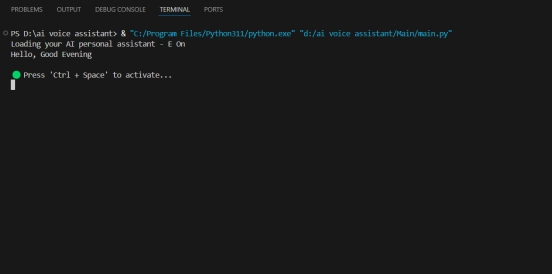
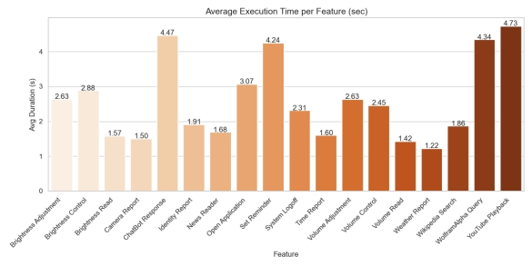

# 🎤 AI Voice Assistant (E-On) - Chat Bot with Virtual Assistant

A powerful, feature-rich AI voice assistant built with Python that demonstrates the practical application of Natural Language Processing (NLP), speech processing, and real-time communication. This intelligent assistant integrates machine learning algorithms, speech synthesis, and cloud AI services to create a smart and learning personal assistant.

## 🎯 Project Overview

**E-On** is an AI-powered voice assistant designed to enhance human-computer interaction through natural language voice commands. The project integrates artificial intelligence, voice processing, and automation to deliver a seamless voice-based experience capable of performing both simple and complex computing tasks.

## 📸 System Overview Gallery

<div align="center">

### System Architecture & Workflow

 

### User Interfaces

 

### Performance Analytics

 

_Complete system overview showcasing architecture, interfaces, and performance analytics_

</div>

### 🔬 Research Context

This project represents a paradigm shift in personal digital assistants, demonstrating:

- **Real-time Voice Recognition**: Using Mozilla DeepSpeech and Google Speech-to-Text API
- **Advanced NLP**: Utilizing spaCy, Rasa, and OpenRouter for context-aware responses
- **Machine Learning Integration**: Powered by Scikit-learn, TensorFlow, and PyTorch
- **Privacy-Friendly Design**: Offline capability with augmentable cloud-based features

## 🌟 Core Features

### 🎯 Intelligent Voice Processing

- **Hotword Activation**: Wake up with "Hey Jarvis" or keyboard shortcut (Ctrl + Space)
- **Multi-Model Speech Recognition**: Google Speech API + OpenAI Whisper integration
- **Natural Language Understanding**: Context-aware command interpretation
- **Real-time Feedback**: Dual audio and visual response system

### 🛠️ Comprehensive Task Automation

#### 📚 Information & Knowledge Management

- **Wikipedia Search**: Intelligent content summarization using LSA (Latent Semantic Analysis)
- **Weather Reports**: Real-time data via OpenWeatherMap API
- **News Updates**: Latest headlines with summarization
- **Wolfram Alpha**: Complex mathematical and computational queries
- **Time & Date**: Current time with contextual greetings

#### 🎵 Media & Entertainment Control

- **YouTube Integration**: Search and play videos using PyWhatKit
- **Camera Operations**: Screenshot and photo capture via ecapture
- **Spotify Control**: Music playback management
- **Browser Automation**: Smart URL navigation and web searches

#### ⚙️ Advanced System Control

- **Brightness Control**: Dynamic screen brightness adjustment
- **Volume Management**: System audio level control
- **Application Launcher**: Voice-activated app opening
- **System Commands**: Safe shutdown and system operations
- **Desktop Notifications**: Reminder system using plyer library

#### 🧠 AI-Powered Conversations

- **Together AI Integration**: Mistral-7B language model for natural conversations
- **ChromaDB Memory**: Vector database for conversation history and context
- **Intelligent Summarization**: Automatic response summarization for lengthy outputs
- **Contextual Awareness**: Personalized responses based on user history

### 📊 Performance Analytics & Monitoring

- **Feature Usage Tracking**: Comprehensive usage statistics
- **Execution Time Analysis**: Real-time performance metrics
- **Success Rate Monitoring**: Command reliability assessment
- **Visual Performance Reports**: Automated graph generation for insights

## 🏗️ System Architecture

### 🔄 Workflow Overview

The AI Voice Assistant operates through a sophisticated multi-stage pipeline:

1. **Voice Input Capture**: Microphone captures user voice commands
2. **Speech-to-Text Conversion**: Google Speech API/Whisper processes audio
3. **NLP Processing**: Python Logic Layer analyzes command intent
4. **Command Routing**: Directs to appropriate functional modules
5. **Task Execution**: Performs requested operations (APIs, system calls, database queries)
6. **Response Generation**: Synthesizes appropriate response
7. **Audio Output**: pyttsx3 engine delivers spoken feedback


_Figure 1: High-Level System Workflow - Voice Input to Audio Output Pipeline_

### 📊 Detailed System Architecture

The comprehensive system architecture demonstrates the integration of multiple AI components:


_Figure 2: Detailed System Architecture - Modular AI Integration Framework_

### 📂 Modular Architecture

```
ai-voice-assistant/
├── Main/                           # Core application files
│   ├── main.py                    # Main entry point with hotword detection
│   ├── features.py                # Core feature implementations
│   ├── functions.py               # Speech processing utilities
│   ├── commands.py                # System command handlers
│   ├── memory.py                  # ChromaDB memory management
│   ├── reminder.py                # Notification system
│   ├── logger.py                  # Performance monitoring
│   └── frontend/                  # Web interface
│       ├── index.html            # Holographic UI with wave animations
│       ├── script.js             # Frontend interaction logic
│       └── style.css             # Modern UI styling
├── resource/                      # Image resources and documentation
│   ├── image1.png                # University logos
│   ├── image2.png                # Institution logos
│   ├── image3.jpeg               # System workflow diagrams
│   ├── image4.jpeg               # Architecture diagrams
│   ├── image5.jpeg               # Interface screenshots
│   ├── image6.jpeg               # Performance analytics
│   ├── image7.jpeg               # Command structure
│   ├── image8.jpeg               # Metrics dashboard
│   └── image9.jpeg               # Web interface
├── logs/                          # Performance analytics
│   ├── feature_logs.csv          # Feature usage statistics
│   └── generated_performance_logs_with_timestamp.csv
├── graphs/                        # Visual performance analytics
│   ├── avg_execution_time.png    # Response time analysis
│   ├── feature_usage.png         # Usage frequency charts
│   ├── feature_success_rate.png  # Reliability metrics
│   └── normalized_confusion_matrix.png
├── chroma_data/                   # ChromaDB vector storage
├── analyze_logs.py               # Performance analysis utilities
└── README.md                     # Project documentation
```

### 🧠 AI Integration Architecture

The system leverages multiple AI services and models:

- **Speech Recognition**: Google Speech API + OpenAI Whisper for multi-modal accuracy
- **Language Processing**: Together AI (Mistral-7B) for intelligent conversations
- **Memory Management**: ChromaDB vector database for contextual awareness
- **Summarization**: Sumy library with LSA algorithm for content condensation
- **Text-to-Speech**: pyttsx3 for natural voice synthesis

### 🖥️ System Interface

#### Startup Interface


_Figure 3: System Startup and Activation Interface - Terminal-based initialization with welcome message_

#### Interactive Web Interface


_Figure 4: Modern Web Interface - Holographic design with voice and chat capabilities_

## 🚀 Installation & Setup

### 📋 Prerequisites

- **Python 3.7+** (Recommended: Python 3.11)
- **Windows OS** (Optimized for Windows, Linux compatible)
- **Microphone & Speakers** for voice interaction
- **Internet Connection** for cloud services and APIs
- **Minimum 4GB RAM** for optimal performance

### 🔧 Dependencies & Libraries

#### Core Speech Processing

```python
speech_recognition      # Google Speech API integration
pyttsx3                # Text-to-speech engine
openai-whisper         # Advanced speech recognition
```

#### AI & NLP

```python
openai                 # Together AI API integration
chromadb              # Vector database for memory
sumy                  # Text summarization (LSA)
spacy                 # Natural language processing
```

#### System Integration

```python
keyboard              # Hotkey detection
subprocess            # System command execution
screen_brightness_control  # Display control
pycaw                 # Audio volume control
ecapture              # Camera operations
plyer                 # Desktop notifications
```

#### Web & API Services

```python
requests              # HTTP requests for APIs
pywhatkit            # YouTube automation
wikipedia            # Wikipedia API access
wolframalpha         # Computational queries
```

### 🗣️ Voice Command Examples

#### Information Queries

```
"Hey Jarvis"
├── "What's the weather in New York?"
├── "Tell me about quantum physics"
├── "Search Wikipedia for artificial intelligence"
├── "What time is it?"
├── "Calculate 25 factorial"
└── "What's the latest news?"
```

#### System Control

```
"Hey Jarvis"
├── "Set brightness to 70%"
├── "Increase volume to 80%"
├── "Open Chrome browser"
├── "Take a screenshot"
├── "Open YouTube"
└── "Shut down the system"
```

#### Entertainment & Media

```
"Hey Jarvis"
├── "Play Despacito on YouTube"
├── "Search for Python tutorials"
├── "Open Spotify"
├── "Take a photo"
└── "Play some relaxing music"
```

#### AI Conversations

```
"Hey Jarvis"
├── "Let's have a conversation about space"
├── "Help me plan my day"
├── "What do you think about current AI trends?"
├── "Summarize this topic for me"
└── "Remember my preference for morning news"
```

### 📝 Advanced Features

#### Memory & Context

- **Conversation History**: ChromaDB stores all interactions
- **Contextual Responses**: References previous conversations
- **User Preferences**: Learns from usage patterns
- **Smart Suggestions**: Provides relevant follow-up questions

#### Performance Monitoring

- **Real-time Analytics**: Monitor command success rates
- **Usage Statistics**: Track most-used features
- **Response Time Analysis**: Optimize performance
- **Error Logging**: Automatic troubleshooting data

## 📈 Performance Analytics & Results

### 🔬 Research Findings

Based on extensive testing and academic evaluation, the AI Voice Assistant demonstrates:

#### Success Metrics

- **>90% Command Success Rate**: Highly reliable command execution
- **1-2 Second Response Time**: Local operations perform in real-time
- **Multi-Modal Accuracy**: Combined Google Speech API + Whisper recognition
- **Context Retention**: ChromaDB enables meaningful conversation continuity

#### Usage Statistics

- **Most Used Features**: Weather queries, YouTube control, reminders, system control
- **Peak Performance**: Volume adjustment and application launching
- **Specialized Operations**: Camera capture and system shutdown (occasional use)
- **AI Conversations**: Natural dialogue through Together AI integration

### 📊 Performance Graphs

The system generates comprehensive analytics:

1. **Feature Usage Frequency**: Bar charts showing command popularity
2. **Success Rate Analysis**: Reliability metrics across all features
3. **Response Time Distribution**: Performance analysis for optimization
4. **Error Pattern Recognition**: Identifies improvement opportunities

#### System Performance Analysis


_Figure 5: Detailed Workflow Analysis - Command processing pipeline and decision logic_

#### Command Structure Analysis


_Figure 6: Modular Command Structure - Component interaction and API integration_

#### Performance Metrics Dashboard


_Figure 7: Performance Analytics Dashboard - Usage statistics, success rates, and response times_

### 📈 Monitoring Commands

```bash
# Generate performance reports
python analyze_logs.py

# View real-time statistics
cd logs/
cat feature_logs.csv

# Access visual analytics
# Check graphs/ directory for PNG reports
```

### 🎯 Academic Validation

The project has been academically validated through:

- **Systematic Testing**: Comprehensive feature evaluation
- **Performance Benchmarking**: Comparison with existing solutions
- **User Experience Analysis**: Usability and accessibility assessment
- **Technical Documentation**: Detailed architectural analysis

## ⚙️ Configuration & Customization

### 🎛️ Voice Settings

Customize voice parameters in `functions.py`:

```python
# Speech rate (words per minute)
engine.setProperty('rate', 150)

# Volume level (0.0 to 1.0)
engine.setProperty('volume', 0.9)

# Voice selection (0 for male, 1 for female)
voices = engine.getProperty('voices')
engine.setProperty('voice', voices[0].id)
```

### 🤖 AI Model Configuration

#### Together AI Settings

```python
# Model selection
MODEL = "mistralai/Mistral-7B-Instruct-v0.1"

# Response parameters
MAX_TOKENS = 500
TEMPERATURE = 0.7
```

#### ChromaDB Configuration

```python
# Memory settings
COLLECTION_NAME = "conversation_history"
EMBEDDING_MODEL = "all-MiniLM-L6-v2"
MAX_MEMORY_ENTRIES = 1000
```

### 🔧 Hotword Customization

Modify activation settings in `main.py`:

```python
# Change hotword phrase
HOTWORD = "hey jarvis"  # Customize this

# Keyboard activation
HOTKEY = "ctrl+space"   # Alternative activation
```

### 🌐 API Endpoint Configuration

#### Weather Service

```python
WEATHER_API_URL = "http://api.openweathermap.org/data/2.5/weather"
DEFAULT_CITY = "Your City"
UNITS = "metric"  # or "imperial"
```

#### Search Preferences

```python
DEFAULT_SEARCH_ENGINE = "google"
WIKIPEDIA_SUMMARY_SENTENCES = 3
NEWS_SOURCE_COUNT = 5
```

## 🚀 Future Scope & Research Directions

### 🔮 Planned Enhancements

#### Advanced AI Capabilities

- **Emotion Detection**: Voice-based sentiment analysis for empathetic responses
- **Multi-Language Support**: Expanding beyond English for global accessibility
- **Offline NLP Processing**: Reduced dependency on cloud services
- **Enhanced Memory**: Advanced user profiling and preference learning

#### IoT & Smart Home Integration

- **Home Automation**: Control smart devices, lights, and appliances
- **Security Systems**: Integration with cameras and alarm systems
- **Environmental Control**: Temperature, humidity, and air quality management
- **Multi-Device Sync**: Seamless operation across multiple devices

#### Technical Improvements

- **Real-time Learning**: Continuous model improvement from user interactions
- **Predictive Commands**: Anticipate user needs based on patterns
- **Voice Biometrics**: Enhanced security through voice authentication
- **Edge Computing**: Local AI processing for improved privacy and speed

### 🎯 Research Applications

#### Academic Research Areas

- **Human-Computer Interaction**: Natural language interface studies
- **AI Ethics**: Privacy-preserving AI assistant development
- **Accessibility Technology**: Assistive technology for disabled users
- **Conversational AI**: Context-aware dialogue systems

#### Industry Applications

- **Healthcare**: Medical voice assistants with specialized vocabularies
- **Education**: Interactive learning and tutoring systems
- **Enterprise**: Corporate automation and productivity tools
- **Automotive**: In-vehicle AI assistant integration

### 📊 Expansion Possibilities

#### Mobile & Cross-Platform

- **Android App**: Native mobile application development
- **iOS Integration**: Swift-based implementation
- **Web App**: Progressive Web App (PWA) for universal access
- **Desktop App**: Electron-based standalone application

#### Cloud & Scalability

- **Microservices Architecture**: Distributed system design
- **Container Deployment**: Docker and Kubernetes integration
- **API Gateway**: RESTful API for third-party integrations
- **Real-time Collaboration**: Multi-user conversation support

## 🤝 Contributing & Development

### 👥 Contributors

**Original Development Team (SIET - AIML Dept.)**

- **Y. Srinivas** (20VE1A6663) - Lead Developer
- **S. L. N. Prahalad** (20VE1A6640) - AI Integration Specialist
- **S. Dinesh Kumar** (20VE1A6644) - System Architecture
- **G. Suryansh** (20VE1A6614) - Frontend Development

**Academic Guidance**

- **Mr. Shivaram Reddy** - Project Supervisor (Assistant Professor)
- **Dr. A. Swathi** - Head of Department (AIML)

### 🔧 Development Guidelines

#### Code Standards

```python
# Follow PEP 8 coding standards
# Example: Function documentation
def handle_voice_command(command: str) -> Dict[str, Any]:
    """
    Process voice command and execute appropriate action.

    Args:
        command (str): Transcribed voice command

    Returns:
        Dict[str, Any]: Execution result with status and response
    """
    pass
```

#### Research Contributions

**Academic Extensions Welcome:**

- **NLP Improvements**: Enhanced natural language understanding
- **Voice Processing**: Better speech recognition algorithms
- **UI/UX Research**: User experience optimization studies
- **Performance Analysis**: Benchmarking and optimization
- **Accessibility Features**: Assistive technology enhancements

### 📊 Quality Assurance

#### Testing Framework

```bash
# Run comprehensive tests
python -m pytest tests/
python test_voice_recognition.py
python test_api_integrations.py
```

#### Performance Monitoring

```bash
# Generate development metrics
python analyze_logs.py --dev-mode
python benchmark_performance.py
```

## �️ Troubleshooting & Support

### 🔧 Common Issues & Solutions

#### Audio & Speech Recognition

```bash
# Issue: Microphone not detected
# Solution: Check device permissions and default audio device
python -c "import speech_recognition as sr; print(sr.Microphone.list_microphone_names())"

# Issue: Poor speech recognition accuracy
# Solution: Test microphone quality and background noise
python test_microphone.py
```

#### API & Network Issues

```bash
# Issue: API key errors
# Solution: Verify API keys in .env file
python -c "import os; print('API Keys loaded:', bool(os.getenv('TOGETHER_AI_API_KEY')))"

# Issue: Network connectivity
# Solution: Test API endpoints
python test_api_connections.py
```

#### Performance Optimization

```bash
# Issue: Slow response times
# Solution: Monitor system resources
python -c "import psutil; print(f'CPU: {psutil.cpu_percent()}%, RAM: {psutil.virtual_memory().percent}%')"

# Issue: Memory leaks
# Solution: Restart ChromaDB and clear cache
python reset_memory_database.py
```

#### Log Analysis

```bash
# View real-time logs
tail -f logs/feature_logs.csv

# Analyze performance trends
python analyze_logs.py --detailed

# Generate debug report
python generate_debug_report.py
```

#### System Diagnostics

```bash
# Test all components
python system_health_check.py

# Validate installations
python validate_environment.py

# Check API connectivity
python api_status_check.py
```

## 📄 License & Citation

### 📜 License

This project is licensed under the **MIT License** - see the [LICENSE](LICENSE) file for details.

### 📚 Academic Citation

If you use this project in your research, please cite:

```bibtex
@misc{voice_assistant_2024,
  title={Chat Bot with Virtual Assistant: An AI-Powered Voice Interface System},
  author={Srinivas, Y. and Prahalad, S.L.N. and Kumar, S.D. and Suryansh, G.},
  year={2024},
  institution={Sreyas Institute of Engineering \& Technology},
  department={Computer Science \& Engineering (AIML)},
  university={Jawaharlal Nehru Technological University, Hyderabad},
  note={B.Tech Final Year Project}
}
```

#### Technology Partners

- **Together AI** - Advanced language model integration (Mistral-7B)
- **OpenAI** - Whisper speech recognition and GPT capabilities
- **Google** - Speech-to-Text API and various cloud services
- **ChromaDB** - Vector database for intelligent memory management
- **OpenWeatherMap** - Real-time weather data services
- **WolframAlpha** - Computational intelligence and factual queries

#### Academic Institution

- **Sreyas Institute of Engineering & Technology**
- **Jawaharlal Nehru Technological University, Hyderabad**
- **Department of Computer Science & Engineering (AIML)**

#### Open Source Community

- Python ecosystem contributors
- Speech recognition library developers
- Natural language processing researchers
- UI/UX design community

---

## 🌟 Project Impact

This AI Voice Assistant represents a significant step forward in human-computer interaction, demonstrating the practical application of:

- **Natural Language Processing** in real-world scenarios
- **Multi-modal AI integration** for enhanced user experience
- **Privacy-conscious design** with local processing capabilities
- **Academic research translation** into functional technology
- **Modular architecture** for sustainable development

The project serves as both a **functional voice assistant** and an **educational resource** for understanding modern AI system development, making it valuable for students, researchers, and developers interested in conversational AI technologies.

**Made with ❤️ by the SIET AIML Team**
_Advancing Human-Computer Interaction Through Intelligent Voice Technology_
